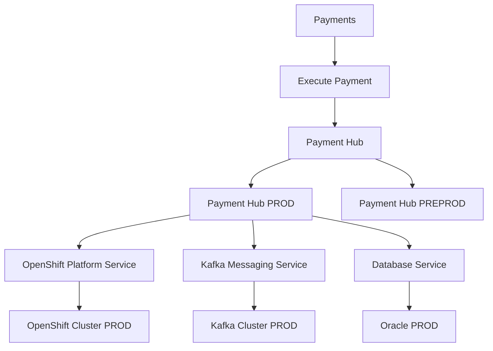

# Modèle CSDM MayaBank

## Ownership proposé

- Capability : métier / enterprise architecture.
- Business Application : application owner + EA.
- Service Instance : application/service owner + opérations.
- Technology Management Service : platform/service owner.
- Infrastructure CI : équipes techniques, alimentés par sources autoritatives.
