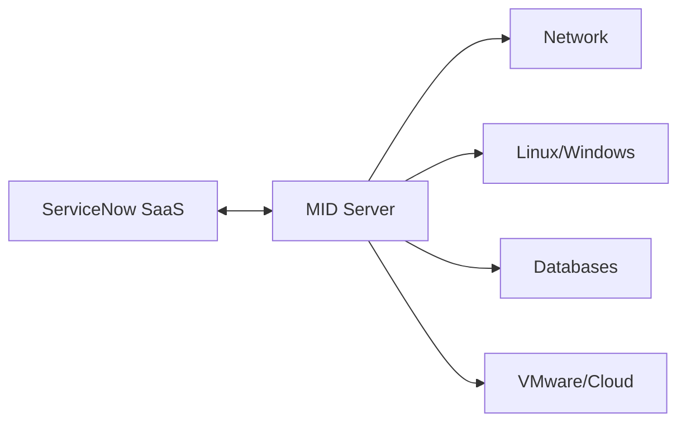

# 05 — Discovery

Objectif architecte : comprendre comment ServiceNow découvre l’infrastructure, quelles dépendances réseau/sécurité existent et comment les résultats sont identifiés dans la CMDB.

## À challenger

- placement et résilience des MID Servers ;
- flux firewall et DNS ;
- comptes/credentials et moindre privilège ;
- IP ranges / schedules ;
- capabilities ;
- patterns ;
- volumétrie et fenêtres de scan ;
- comportement IRE ;
- erreurs de découverte et ownership.

Référence : https://www.servicenow.com/docs/r/servicenow-platform/mid-server/explore-mid-server.html
