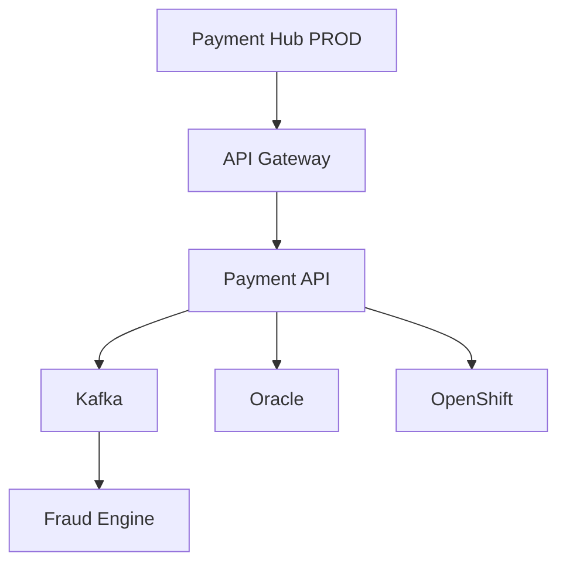

# 06 — Service Mapping

Discovery répond surtout à **« quels CI existent ? »** ; Service Mapping répond à **« quels CI et dépendances délivrent ce service ? »**.

L’architecte définit le périmètre, les entry points, les dépendances utiles et la stratégie de maintenance.

Référence : https://www.servicenow.com/docs/r/it-operations-management/service-mapping/service-mapping-setup.html
