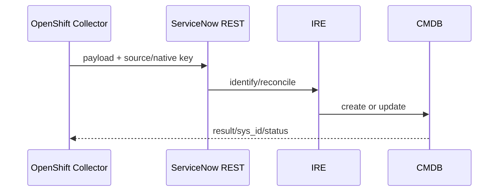

# IRE API

Le POC MayaBank utilisera un payload contrôlé vers l’API IRE appropriée à la release PDI.

## Flux

Avant exécution : vérifier endpoint, rôles, format exact du payload et comportement de la release.
