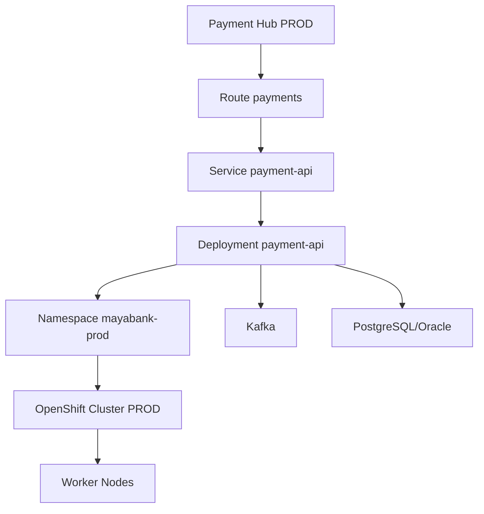

# Modèle MayaBank OpenShift

```mermaid
flowchart TD
  SI[Payment Hub PROD] --> R[Route payments]
  R --> S[Service payment-api]
  S --> D[Deployment payment-api]
  D --> NS[Namespace mayabank-prod]
  NS --> C[OpenShift Cluster PROD]
  C --> N[Worker Nodes]
  D --> K[Kafka]
  D --> DB[PostgreSQL/Oracle]
```

Le modèle exact dépend des classes fournies par la release/connecteur. Le diagramme exprime la sémantique cible, pas une garantie de noms de tables ServiceNow.
