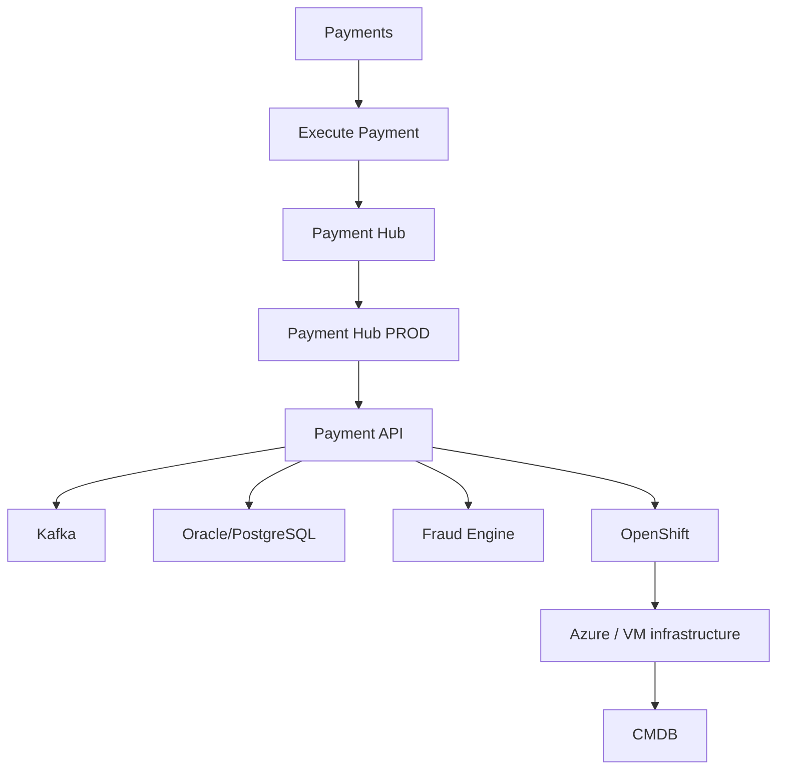

# Architecture cible MayaBank

```mermaid
flowchart TD
  B[Payments] --> C[Execute Payment]
  C --> BA[Payment Hub]
  BA --> SI[Payment Hub PROD]
  SI --> API[Payment API]
  API --> K[Kafka]
  API --> DB[Oracle/PostgreSQL]
  API --> F[Fraud Engine]
  API --> OCP[OpenShift]
  OCP --> AZ[Azure / VM infrastructure]
  AZ --> CMDB[CMDB]
```

Sources candidates : OpenShift API, Azure, Discovery, référentiel applicatif. Toutes convergent par un design IRE et une gouvernance explicite.
