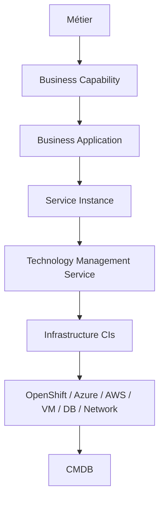
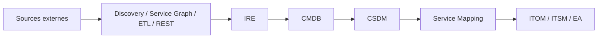

# MayaBank — ServiceNow CSDM / CMDB / ITOM Architecture

Référentiel professionnel et laboratoire différé pour construire un niveau **Architecte Solution — ServiceNow CSDM / CMDB / ITOM — OpenShift / Azure**.

> État : **V1 complète**. Les chapitres d’architecture sont documentés. Les labs nécessitant une PDI, Discovery, Service Mapping, Azure ou OpenShift sont préparés et marqués `À EXÉCUTER` jusqu’à exécution réelle.

## Chaîne cible

Population et gouvernance :

## Parcours

1. [Roadmap](00-roadmap/README.md)
2. [ServiceNow Foundations](01-servicenow-foundations/README.md)
3. [CMDB](02-cmdb/README.md)
4. [CSDM 5](03-csdm/README.md)
5. [IRE](04-ire/README.md)
6. [Discovery](05-discovery/README.md)
7. [Service Mapping](06-service-mapping/README.md)
8. [CMDB Health](07-cmdb-health/README.md)
9. [IntegrationHub ETL / Service Graph](08-integrationhub-etl/README.md)
10. [REST / IRE API](09-rest-api/README.md)
11. [ITOM](10-itom/README.md)
12. [Azure](11-azure/README.md)
13. [OpenShift](12-openshift/README.md)
14. [Enterprise Architecture](13-enterprise-architecture/README.md)
15. [Security](14-security/README.md)
16. [Governance](15-governance/README.md)
17. [ADR](16-architecture-decisions/README.md)
18. [MayaBank POC](17-mayabank-poc/README.md)
19. [Interview preparation](18-interview-preparation/README.md)
20. [Labs à exécuter](labs/README.md)

## Terminologie CSDM 5

- **Service Instance** : terme CSDM v5 ; appelé *Application Service* avant CSDM v5.
- **Technology Management Service** : anciennement *Technical Service*.
- Les deux vocabulaires sont conservés dans le dépôt pour être à l’aise avec les environnements existants.

## Règle d’architecture

Aucun CI n’est ajouté « parce qu’on peut ». Chaque objet doit avoir un usage opérationnel ou de gouvernance, un propriétaire, une source, une règle d’identification, un cycle de vie et des relations justifiables.

## Méthode des labs

`Concept → Architecture → MayaBank → Manipulation → Vérification → Questions d’entretien → Documentation → Commit → Validation`.

## Références officielles

- CSDM : https://www.servicenow.com/docs/r/servicenow-platform/common-service-data-model-csdm/csdm-term-definitions.html
- IRE : https://www.servicenow.com/docs/r/servicenow-platform/configuration-management-database-cmdb/c_CMDBIdentifyandReconcile.html
- Service Instances : https://www.servicenow.com/docs/r/servicenow-platform/configuration-management-database-cmdb/application-services.html

## Positionnement honnête

Ce dépôt démontre une capacité de conception, de POC et de raisonnement d’architecture. Il ne remplace pas une expérience projet ServiceNow de plusieurs années et ne doit jamais être présenté comme telle.
